# Modul Praktikum: Aplikasi CRUD Data Mahasiswa dengan CodeIgniter 4

Modul ini menjelaskan langkah-langkah membuat aplikasi CRUD (Create, Read, Update, Delete) Data Mahasiswa menggunakan framework CodeIgniter 4, dibantu dengan Artificial Intelligence (Claude) selama proses pengembangan.

**Nama:** Muhammad Fathir
**NIM:** 714220021
**Framework:** CodeIgniter 4
**Database:** MySQL (XAMPP)

---

## 1. Instalasi Framework

Framework yang dipakai di modul ini adalah CodeIgniter 4, diinstal lewat Composer dengan perintah:

```bash
composer create-project codeigniter4/appstarter .
```

Pas pertama kali nyoba, sempat kejadian error terkait rate limit dari GitHub API — soalnya Composer nge-request ke GitHub tanpa autentikasi, jadi kena batas jumlah request per jam. Solusinya bikin GitHub Personal Access Token dulu di halaman Settings > Developer Settings > Personal Access Tokens, terus disimpan permanen ke Composer pakai perintah:

```bash
composer config --global --auth github-oauth.github.com <token>
```

Setelah token-nya kesimpen, instalasi lanjut lancar. Composer narik CodeIgniter 4 versi 4.7.4 beserta 33 dependency yang dibutuhkan, lalu di-extract otomatis. Begini struktur folder yang muncul setelah instalasi kelar:

- `app/` — tempat kode aplikasi: Controller, Model, View, dan konfigurasi
- `public/` — folder yang jadi document root, diakses langsung dari browser
- `system/` — inti CodeIgniter, biasanya nggak diutak-atik
- `writable/` — buat nyimpen cache, log, sama file upload
- `vendor/` — isinya dependency-dependency yang barusan diinstal
- `spark` — CLI tool bawaan CI4, dipakai buat jalanin server dan generate kode
- `env` — file konfigurasi environment, nanti di-rename jadi `.env` di tahap konfigurasi

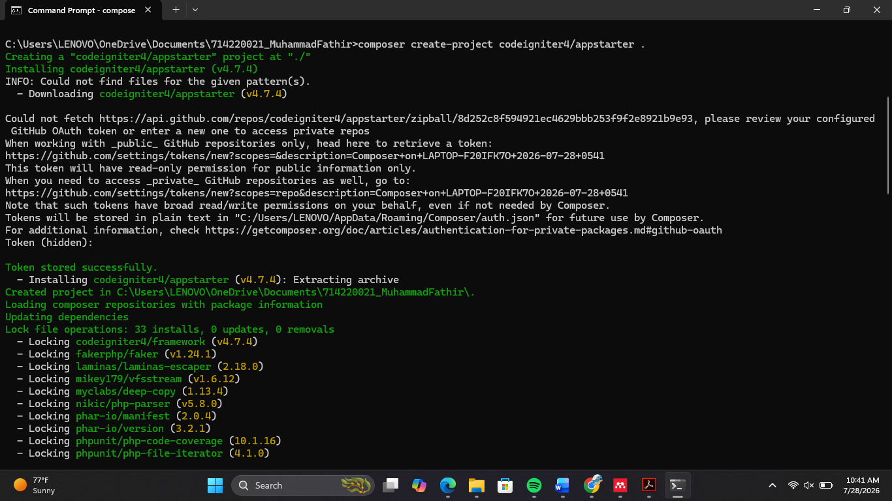

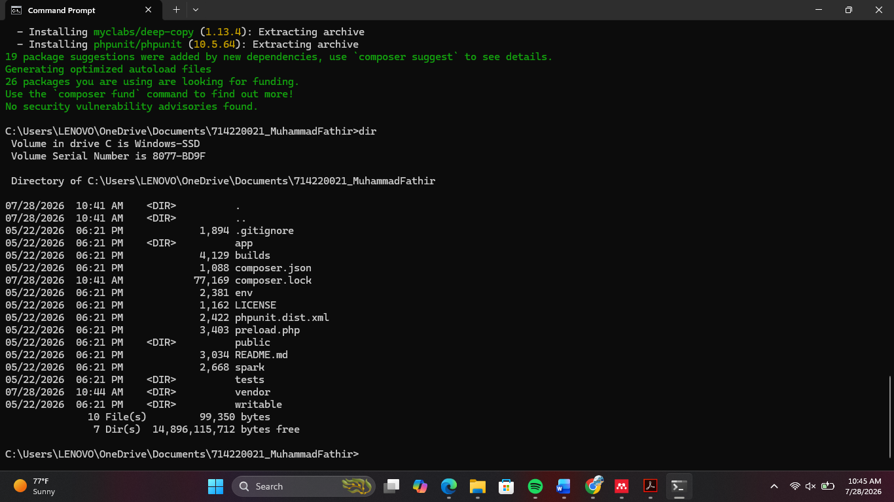

**Prompt AI yang digunakan:**
"Bagaimana cara install CodeIgniter 4 menggunakan Composer, dan bagaimana mengatasi error rate limit GitHub API saat proses instalasi?"

---

## 2. Konfigurasi Project

Setelah instalasi selesai, langkah berikutnya adalah konfigurasi file environment. File `env` bawaan CodeIgniter di-rename jadi `.env`, soalnya file inilah yang bakal dibaca sama framework buat nentuin environment aplikasi dan pengaturan lain.

Di dalam `.env`, baris `CI_ENVIRONMENT` diubah dari `production` ke `development`:

```
CI_ENVIRONMENT = development
```

Mode development dipakai selama proses pengembangan karena nampilin pesan error secara detail, jadi lebih gampang buat nemuin bug. Selain itu, `app.baseURL` juga diisi sesuai alamat lokal:

```
app.baseURL = 'http://localhost:8080/'
```

Setelah konfigurasi disimpan, server bawaan CodeIgniter dijalankan buat mastiin aplikasi bisa diakses:

```bash
php spark serve
```

Kalau konfigurasi udah bener, halaman welcome default CodeIgniter bakal muncul saat `http://localhost:8080` dibuka di browser.

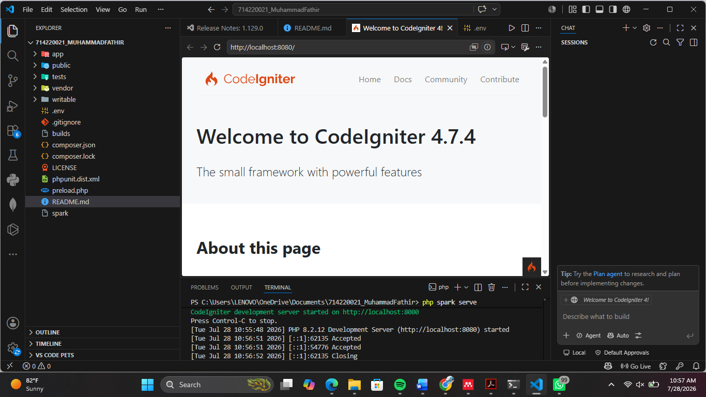

**Prompt AI yang digunakan:**
"Bagaimana cara konfigurasi file .env di CodeIgniter 4, dan apa fungsi CI_ENVIRONMENT serta app.baseURL?"

---

## 3. Konfigurasi Database

Database yang dipakai di modul ini adalah MySQL, dijalankan lewat XAMPP. Sebelum konek ke CodeIgniter, database baru dibuat dulu lewat phpMyAdmin dengan nama `db_ukpemrograman`. Di awal, database ini masih kosong belum ada tabel sama sekali.

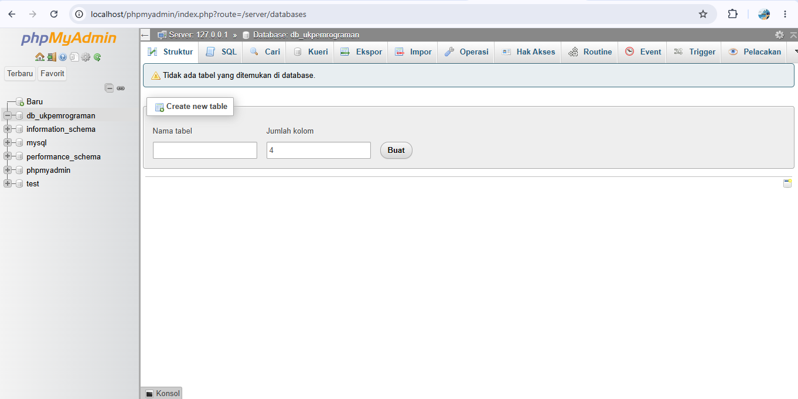

Selanjutnya, pengaturan koneksi database diisi di file `.env`:

```
database.default.hostname = localhost
database.default.database = db_ukpemrograman
database.default.username = root
database.default.password =
database.default.DBDriver = MySQLi
database.default.port = 3306
```

Karena pakai XAMPP default, username-nya `root` dan password dikosongin. Buat mastiin koneksi udah bener, dites pakai perintah spark:

```bash
php spark db:table --show
```

Kalau perintah ini jalan tanpa error, artinya CodeIgniter udah berhasil konek ke database MySQL.

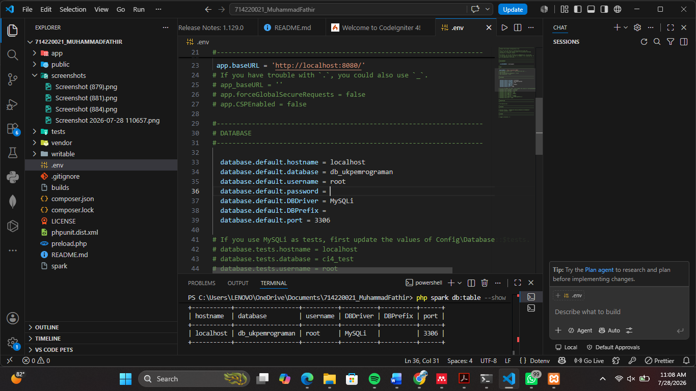

**Prompt AI yang digunakan:**
"Bagaimana cara konfigurasi koneksi database MySQL di CodeIgniter 4 melalui file .env, dan bagaimana cara mengetes apakah koneksinya berhasil?"

---

## 4. Pembuatan Migration

Migration dipakai buat bikin struktur tabel lewat kode, jadi perubahan skema database bisa di-track dan gampang di-share ke tim (walau di modul ini dikerjain individu). File migration di-generate pakai spark:

```bash
php spark make:migration CreateMahasiswaTable
```

File yang ke-generate otomatis ada di `app/Database/Migrations/`, lalu diisi definisi tabel `mahasiswa` dengan field: `id`, `nim`, `nama`, `jurusan`, `email`, `created_at`, dan `updated_at`. Struktur field ini didefinisikan pakai method `addField()` dari Query Builder Forge bawaan CodeIgniter.

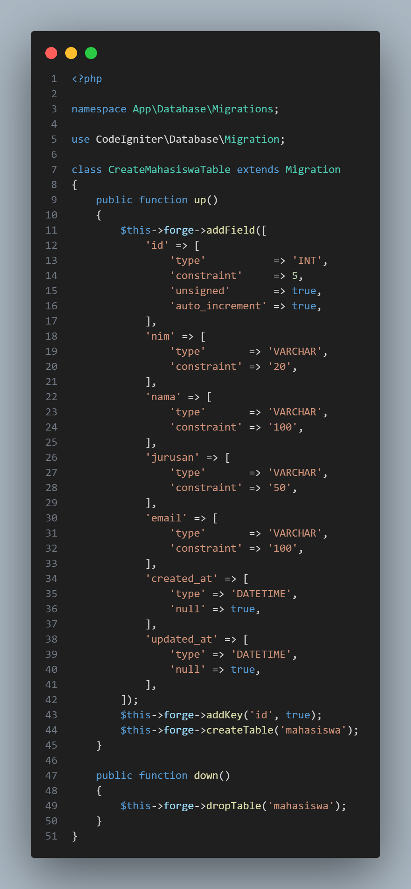

Setelah migration-nya diisi, dijalankan pakai:

```bash
php spark migrate
```

Perintah ini bakal ngeksekusi method `up()` di file migration, otomatis bikin tabel `mahasiswa` di database `db_ukpemrograman` sesuai struktur yang udah didefinisikan.

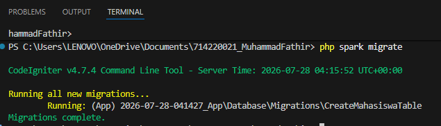

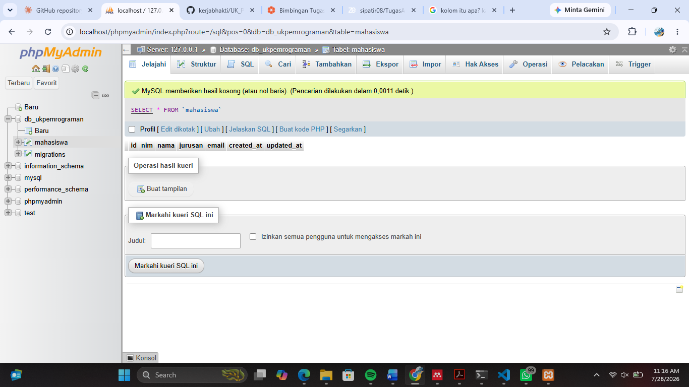

**Prompt AI yang digunakan:**
"Bagaimana cara membuat migration di CodeIgniter 4 untuk tabel mahasiswa dengan field nim, nama, jurusan, dan email?"

---

## 5. Pembuatan Model

Model dibuat buat ngatur interaksi ke tabel `mahasiswa`, jadi query database nggak perlu ditulis manual tiap butuh data. File model di-generate lewat spark:

```bash
php spark make:model MahasiswaModel
```

File yang ke-generate ada di `app/Models/MahasiswaModel.php`, lalu dikonfigurasi dengan menentukan nama tabel, primary key, dan field yang boleh diisi (`allowedFields`). Field `id` sengaja nggak dimasukin ke `allowedFields` karena udah auto increment, begitu juga `created_at`/`updated_at` yang otomatis keisi berkat `useTimestamps` diset `true`.

Selain itu, model ini juga udah dilengkapi `validationRules` bawaan, jadi validasi data (misal email harus format valid, field wajib diisi) bisa langsung jalan tiap kali proses insert atau update lewat model, tanpa perlu nulis validasi terpisah di Controller.

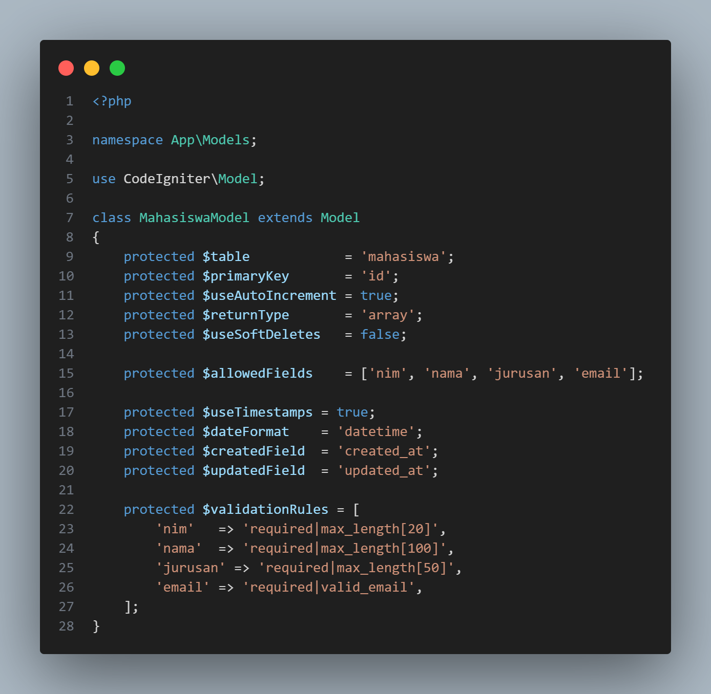

**Prompt AI yang digunakan:**
"Bagaimana cara membuat Model di CodeIgniter 4 untuk tabel mahasiswa, lengkap dengan allowedFields, timestamps otomatis, dan validation rules?"

---

## 6. Pembuatan Controller

Controller dibuat buat ngatur alur logic CRUD, mulai dari nerima request dari user, manggil Model buat proses ke database, sampai nentuin View mana yang ditampilin. File controller di-generate lewat spark:

```bash
php spark make:controller Mahasiswa
```

Di dalam Controller `Mahasiswa.php`, instance dari `MahasiswaModel` dibuat di constructor supaya bisa dipakai di semua method. Ada 6 method utama yang dibuat:

- `index()` — nampilin semua data mahasiswa
- `create()` — nampilin form tambah data
- `store()` — nyimpen data baru dari form ke database
- `edit($id)` — nampilin form edit berisi data yang mau diubah
- `update($id)` — nyimpen perubahan data ke database
- `delete($id)` — hapus data berdasarkan id

Method `store()` dan `update()` make method `getPost()` buat ngambil data dari form, sementara `save()`, `update()`, dan `delete()` dari Model otomatis ngurus query ke database tanpa perlu nulis SQL manual.

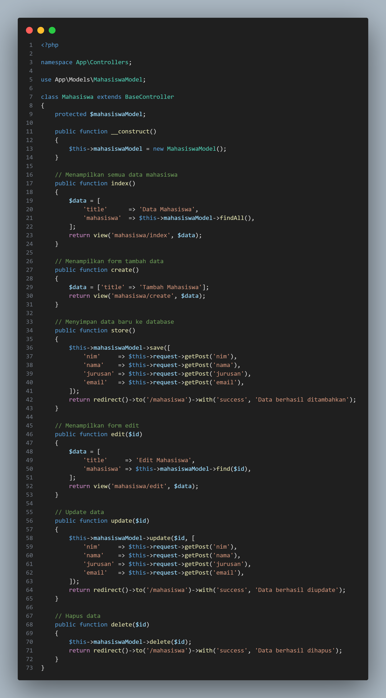

**Prompt AI yang digunakan:**
"Bagaimana cara membuat Controller CRUD di CodeIgniter 4 untuk resource mahasiswa, lengkap dengan method index, create, store, edit, update, dan delete?"

---

## 7. Pembuatan View

View dibuat buat nampilin antarmuka ke user, ditaruh di folder `app/Views/mahasiswa/` dengan 3 file: `index.php` (tabel daftar mahasiswa), `create.php` (form tambah data), dan `edit.php` (form ubah data).

Di `index.php`, data mahasiswa yang dikirim dari Controller di-loop pakai `foreach` buat ditampilin per baris tabel. Semua output data dibungkus fungsi `esc()` bawaan CodeIgniter buat nyegah serangan XSS (Cross-Site Scripting), jadi kalau ada karakter HTML/script di input data, otomatis di-escape dan nggak dieksekusi browser.

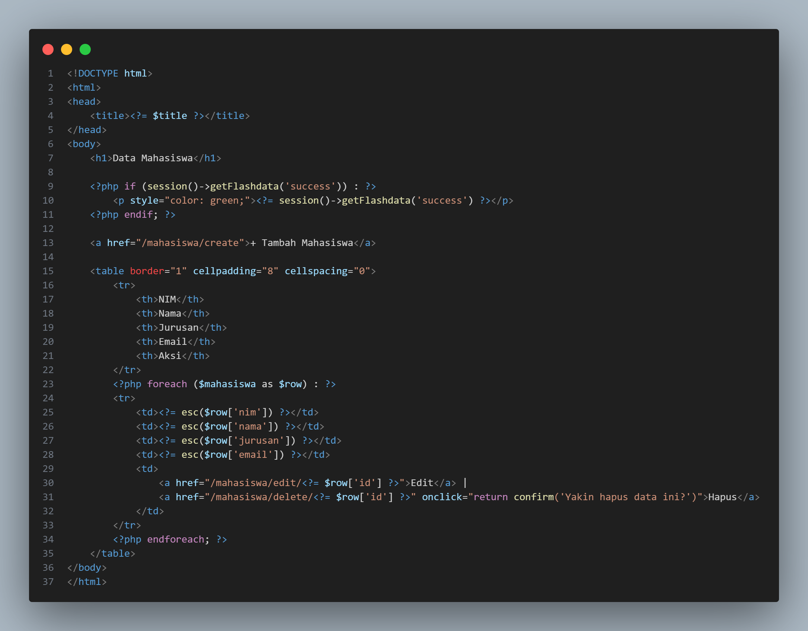

File `create.php` dan `edit.php` isinya form HTML biasa yang ngirim data lewat method POST ke Controller. Bedanya, form edit udah keisi otomatis (`value="<?= esc($mahasiswa['nim']) ?>"`) sesuai data yang mau diubah, sementara form create kosong.

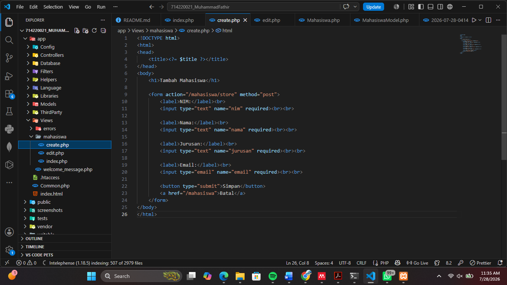

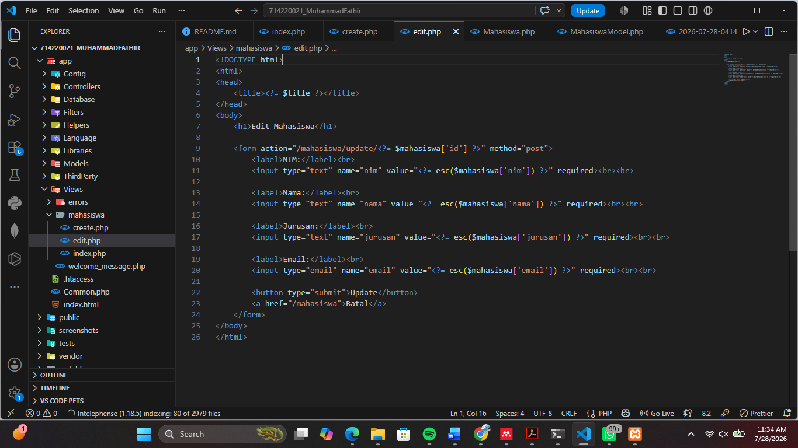

Saat pembuatan View ini, sempat muncul warning "Undefined variable" (garis merah) di variabel `$title` dan `$mahasiswa` pada editor VS Code. Ini bukan error sungguhan, melainkan keterbatasan extension Intelephense (linter PHP) yang cuma baca isi file View sendirian, tanpa tau kalau variabel tersebut sebenarnya dikirim dari Controller lewat method `view('mahasiswa/edit', $data)`. Aplikasi tetap berjalan normal tanpa error saat dites langsung di browser, jadi warning ini bisa diabaikan.

**Prompt AI yang digunakan:**
"Bagaimana cara membuat View di CodeIgniter 4 untuk menampilkan tabel data dan form tambah/edit, lengkap dengan proteksi XSS menggunakan esc()? Kenapa muncul warning undefined variable padahal aplikasinya tidak error?"

---

## 8. Routing

Routing berfungsi buat ngubungin URL yang diakses user ke method Controller yang sesuai. Semua rute didefinisikan di `app/Config/Routes.php`:

```php
$routes->get('/mahasiswa', 'Mahasiswa::index');
$routes->get('/mahasiswa/create', 'Mahasiswa::create');
$routes->post('/mahasiswa/store', 'Mahasiswa::store');
$routes->get('/mahasiswa/edit/(:num)', 'Mahasiswa::edit/$1');
$routes->post('/mahasiswa/update/(:num)', 'Mahasiswa::update/$1');
$routes->get('/mahasiswa/delete/(:num)', 'Mahasiswa::delete/$1');
```

Method HTTP `get` dipakai buat rute yang cuma nampilin halaman, sedangkan `post` dipakai buat rute yang nerima data kiriman dari form (store dan update). Placeholder `(:num)` dipakai buat nangkep parameter id dari URL, yang otomatis diteruskan ke method Controller sebagai argumen `$1`.

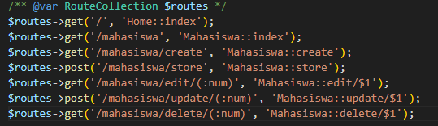

Setelah routing didefinisikan, halaman `/mahasiswa` bisa langsung diakses di browser dan otomatis manggil method `index()` di Controller. Di awal, tabel masih kosong karena belum ada data yang ditambahkan.

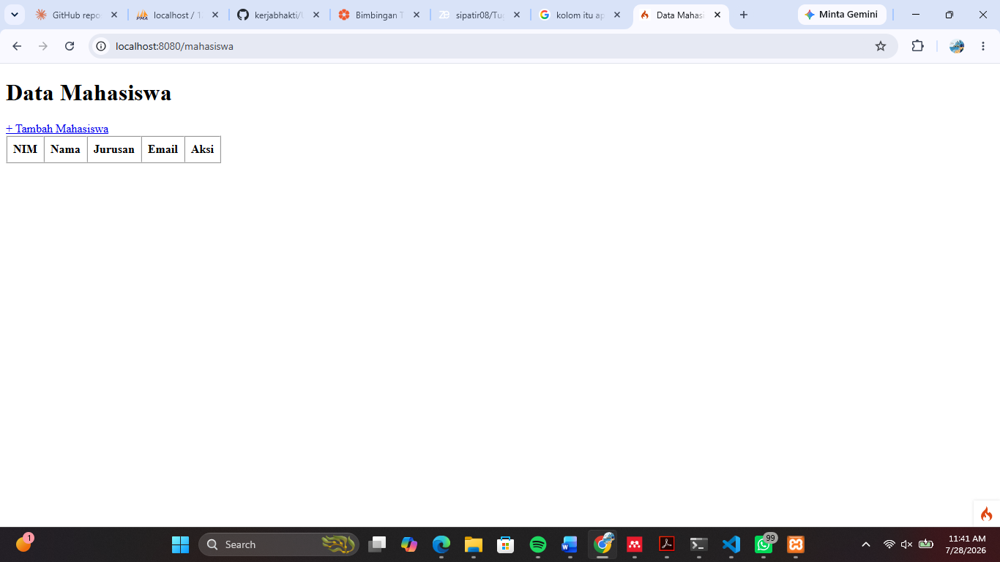

**Prompt AI yang digunakan:**
"Bagaimana cara membuat routing di CodeIgniter 4 untuk resource mahasiswa, termasuk routing dengan parameter id menggunakan placeholder (:num)?"

---

## 9. Implementasi CRUD

Setelah Model, Controller, View, dan Routing selesai dibuat, tahap ini adalah pengujian fungsi CRUD (Create, Read, Update, Delete) secara langsung lewat browser.

**Create** — Data mahasiswa baru ditambahkan lewat form di halaman `/mahasiswa/create`. Data yang diinput dikirim lewat method POST ke `store()`, lalu disimpan ke database menggunakan method `save()` dari Model.

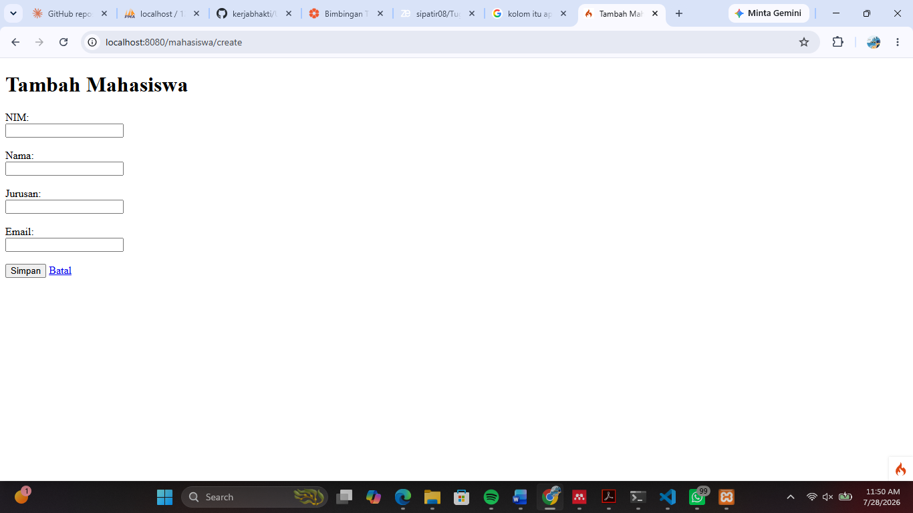

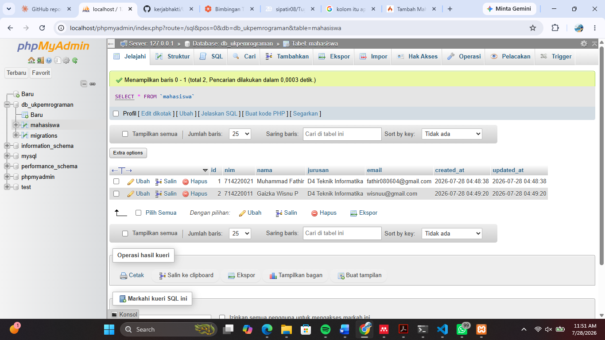

Data kedua juga ditambahkan buat mastiin proses create konsisten dan tabel bisa nampung lebih dari satu baris data.

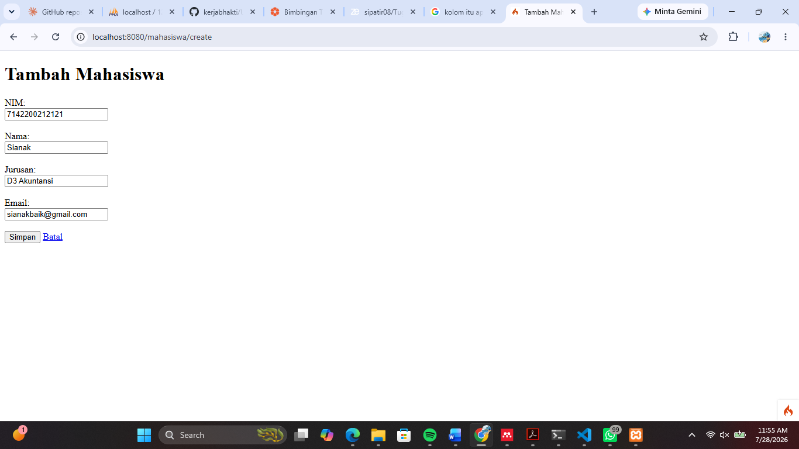

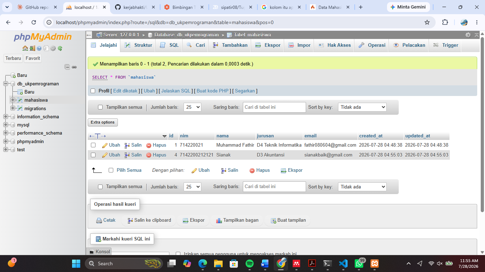

**Read** — Data yang tersimpan otomatis ditampilkan di halaman `/mahasiswa` dalam bentuk tabel, diambil lewat method `findAll()` di Model dan di-loop pakai `foreach` di View. Kedua data yang sudah ditambahkan tampil dengan benar sesuai yang ada di database.

**Update** — Data yang mau diubah diakses lewat link Edit, yang mengarahkan ke form berisi data lama (diambil pakai method `find($id)`). Setelah data diubah dan disubmit, method `update()` di Controller memperbarui data di database.

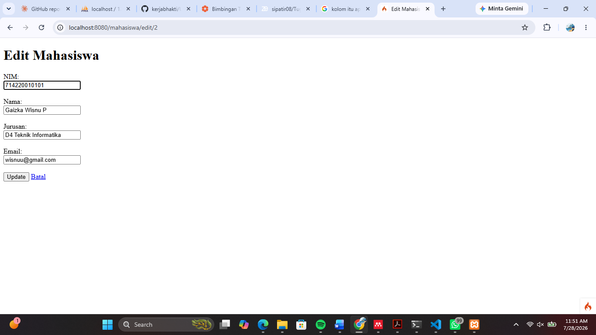

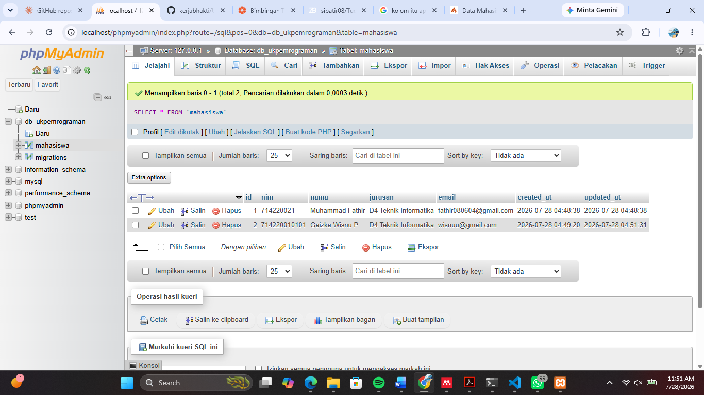

**Delete** — Data dihapus lewat link Hapus yang memicu konfirmasi JavaScript (`confirm()`) sebelum request dikirim ke method `delete()` di Controller, yang kemudian menghapus data lewat method `delete()` di Model.

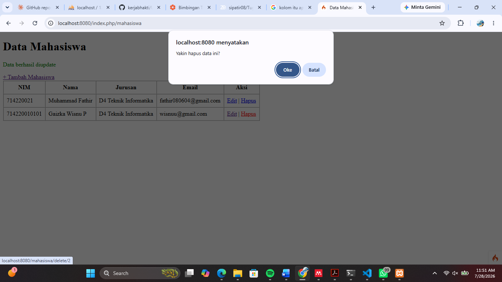

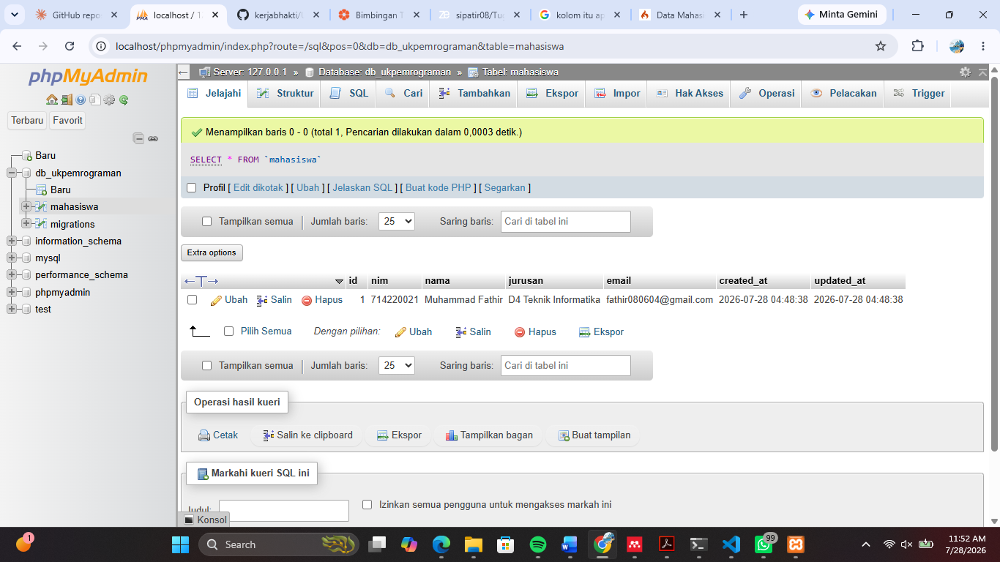

Seluruh proses CRUD berhasil dijalankan tanpa error, dan perubahan data langsung terlihat di tabel maupun database.

**Prompt AI yang digunakan:**
"Bagaimana cara menguji fungsi CRUD (Create, Read, Update, Delete) di aplikasi CodeIgniter 4 secara langsung melalui browser?"

---

## 10. Pengujian Aplikasi

Tahap terakhir ini adalah verifikasi bahwa seluruh proses CRUD yang dijalankan lewat aplikasi benar-benar tersimpan dan konsisten dengan data di database. Pengecekan dilakukan lewat phpMyAdmin dengan membandingkan data yang tampil di tabel `mahasiswa` dengan data yang terlihat di halaman `/mahasiswa` pada aplikasi, dan hasilnya konsisten di kedua sisi.

Kolom `created_at` dan `updated_at` juga diperiksa untuk memastikan timestamp terisi otomatis sesuai waktu data ditambahkan atau diubah, sebagai bukti konfigurasi `useTimestamps` pada Model berfungsi dengan benar. Terlihat dari data yang diedit, kolom `updated_at` berubah sesuai waktu editan dilakukan, sementara `created_at` tetap sesuai waktu data pertama kali dibuat.

Selain itu, validasi dasar pada form turut diuji dengan mencoba submit data kosong atau format email yang salah. Browser langsung menolak submit karena atribut `required` dan `type="email"` pada elemen input, menunjukkan validasi di sisi client sudah berjalan sebagaimana mestinya.

Dari hasil pengujian ini, dapat disimpulkan bahwa aplikasi CRUD Data Mahasiswa berbasis CodeIgniter 4 sudah berjalan sesuai fungsinya, mulai dari instalasi framework, konfigurasi, migration, model, controller, view, routing, hingga operasi CRUD ke database.

**Prompt AI yang digunakan:**
"Bagaimana cara memverifikasi bahwa data hasil CRUD di aplikasi CodeIgniter 4 sudah konsisten dan tersimpan dengan benar di database MySQL?"

---

## Ringkasan Prompt AI yang Digunakan

Berikut kumpulan prompt AI (Claude) yang digunakan sepanjang proses pengembangan modul ini:

1. "Bagaimana cara install CodeIgniter 4 menggunakan Composer, dan bagaimana mengatasi error rate limit GitHub API saat proses instalasi?"
2. "Bagaimana cara konfigurasi file .env di CodeIgniter 4, dan apa fungsi CI_ENVIRONMENT serta app.baseURL?"
3. "Bagaimana cara konfigurasi koneksi database MySQL di CodeIgniter 4 melalui file .env, dan bagaimana cara mengetes apakah koneksinya berhasil?"
4. "Bagaimana cara membuat migration di CodeIgniter 4 untuk tabel mahasiswa dengan field nim, nama, jurusan, dan email?"
5. "Bagaimana cara membuat Model di CodeIgniter 4 untuk tabel mahasiswa, lengkap dengan allowedFields, timestamps otomatis, dan validation rules?"
6. "Bagaimana cara membuat Controller CRUD di CodeIgniter 4 untuk resource mahasiswa, lengkap dengan method index, create, store, edit, update, dan delete?"
7. "Bagaimana cara membuat View di CodeIgniter 4 untuk menampilkan tabel data dan form tambah/edit, lengkap dengan proteksi XSS menggunakan esc()? Kenapa muncul warning undefined variable padahal aplikasinya tidak error?"
8. "Bagaimana cara membuat routing di CodeIgniter 4 untuk resource mahasiswa, termasuk routing dengan parameter id menggunakan placeholder (:num)?"
9. "Bagaimana cara menguji fungsi CRUD (Create, Read, Update, Delete) di aplikasi CodeIgniter 4 secara langsung melalui browser?"
10. "Bagaimana cara memverifikasi bahwa data hasil CRUD di aplikasi CodeIgniter 4 sudah konsisten dan tersimpan dengan benar di database MySQL?"